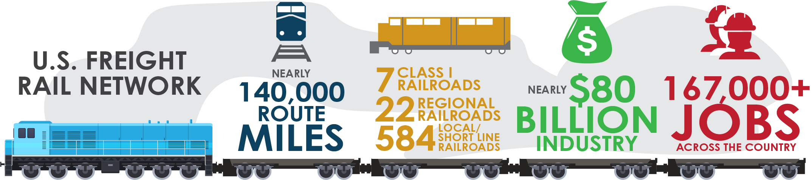

# The Impact of Rising Temperatures on the US Freight Rail Network

Nathan Chan
ENCE 620, Fall 2024

---

# US Freight Rail Network

- The US Freight Rail network is an important part of the US economy
- This network is exposed to various risks including rising temperatures




---

# Objective

The objective of this project is to **develop a methodology for assessing the impact of increased temperatures on US freight rail network and illustrate the proposed methodology**. The output will be a relative indication of the risk exposure for various areas of the network that takes into account network topology, usage and climate hazard. 

---

# Methodology

1. Create simplified, FAF-aligned network
2. Perform Analysis on Unweighted Network
3. Repeat Analysis on Weighted Networks

```
Unweighted FAF Network
            ↓
Freight Tonnage Weighted 
            ↓
Temperature + Freight Tonnage Weighted
```

---
# 1. Create simplified, FAF-aligned network
## Simplified Network

| Network Name | Nodes | Edges |
| ------------ | ----- | ----- |
| US Rail Network | 250,000 | 289,000 |
| Simplified FAF-Aligned Network |  139 | 275 |
| Aggregate Network | 100 | 226 |

---

# 1. Create simplified, FAF-aligned network
## Simplified Network


---

#### Network Edge Properties and Weighting

Apply weights based on factors like rail network structure. Calculate properties like shortest-path betweenness centrality and FAF Freight Tonnage for 2050.

---

#### FAF Freight Tonnage

Use FAF 2050 projections for freight tonnage. Apply a shortest path algorithm to approximate freight paths. Spread intra-zone tonnage across edges.

---

### Summary of Data Sources Used

- North American Rail Network Lines
- Freight Analysis Framework Zones
- Freight Analysis Framework tonnages
- SPEAR model for temperature projections

---

## Results

### FAF Zone Network

The FAF Network has 139 nodes and 275 edges after modifications. It shows higher clustering and different connectivity compared to the aggregate network.

---

### Network Comparison

| Metric | NTAD | FAF | Aggregate |
|--------|------|-----|-----------|
| Nodes  | 250436 | 139 | 100 |
| Links  | 289309 | 275 | 226 |
| Density| 0.000009 | 0.029 | 0.046 |
| Mean Degree | 2.310 | 3.957 | 4.520 |
| Clustering | 0.04333 | 0.445 | 0.396 |

---

### Node Degree Distribution

FAF and NTAD networks show similar node degree distributions.

---

## Discussion

---

## Conclusion & Future Work

Quantifying climate change impacts is vital for adaptation. This project combines freight flow data with rail network topology. Future work includes model accuracy verification against other data sources.

---

### References

\bibliography{references}

